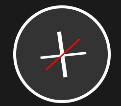
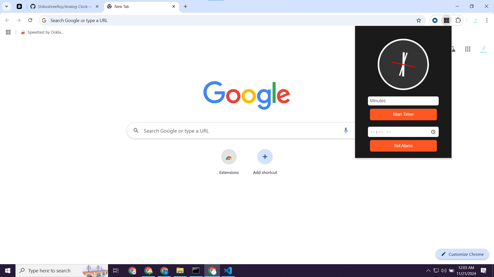

---

# Analog Clock with Timer & Alarm

A professional **Analog Clock** Chrome extension with a built-in **timer** and **alarm** functionality. This extension allows you to set alarms, track time using the analog clock, and receive notifications for set events. It's an ideal tool for time management, reminders, and notifications.

## Features

- **Analog Clock Interface**: Displays a classic analog clock with hours, minutes, and seconds.
- **Timer Functionality**: Set a timer and get notifications when the time is up.
- **Alarm Functionality**: Set alarms for any time, with customizable alarm sound and notification.
- **Simple and Intuitive**: Easy-to-use interface with smooth animations.

## Installation

### 1. Clone or Download the Repository

You can either clone this repository using Git:

```bash
git clone https://github.com/ShiboshreeRoy/Analog-Clock-with-Timer-Alarm-Chrome-extention.git
```

Or download the ZIP file from the GitHub repository and extract it.

### 2. Load Extension in Chrome

1. Open Chrome and navigate to `chrome://extensions/`.
2. Enable **Developer mode** at the top right of the Extensions page.
3. Click the **Load unpacked** button.
4. Select the folder where the extension files are located (the folder containing `manifest.json`).

### 3. Enjoy the Extension

The extension icon will now appear in the Chrome toolbar. Click on it to open the popup and start using the analog clock, set timers, and alarms.

## Usage

1. **Analog Clock**: The clock is displayed on the extension popup with a real-time updating interface.
2. **Setting a Timer**: Click the timer icon to set a countdown. The timer will alert you when the countdown finishes.
3. **Setting an Alarm**: Use the alarm feature to set specific times for alarms. The extension will notify you when the set time is reached.

## Permissions

This extension uses the following Chrome extension permissions:

- `storage`: Allows the extension to store user preferences and data locally.
- `alarms`: Allows the extension to set and trigger alarms.
- `notifications`: Used to display notifications when a timer or alarm goes off.

## Files

### `manifest.json`

The **manifest file** that contains the metadata for the extension, including the permissions, background scripts, and popup setup.

### `popup.html`

The **HTML file** that defines the user interface for the popup window, where the analog clock, timer, and alarm functionalities are displayed.

### `background.js`

The **background script** responsible for handling timer and alarm events. It runs in the background and manages alarms and notifications.

### `icons/`

A folder containing the **icons** for the extension in various sizes (16px, 48px, 128px).

## Screenshots

Here are some screenshots of the game:




---


## Version History

- **1.0.1**: Initial release with functional analog clock, timer, and alarm.
- **1.0.0**: First draft (basic clock and timer).

## Author

- **Author**: Shiboshree Roy
- **Developer**: Shiboshree Roy

## License

This project is licensed under the MIT License.

## Support

For any issues, bugs, or suggestions, feel free to create an issue in the **GitHub Issues** tab or contact the author at **shiboshreeroy169.com**.


